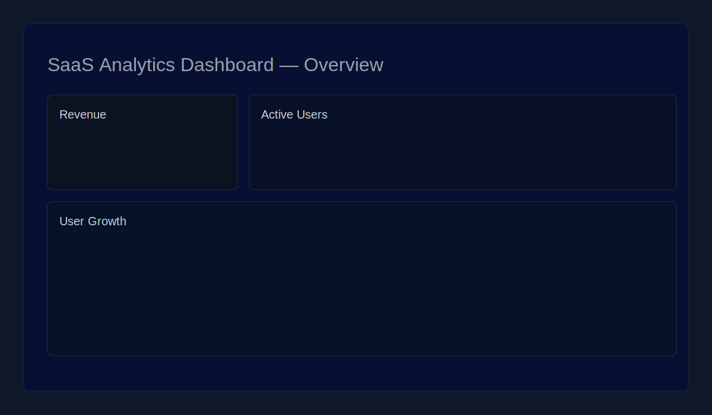
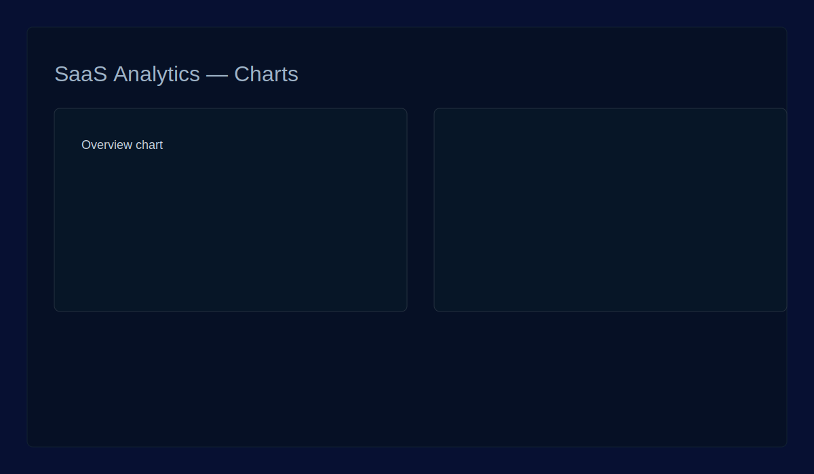
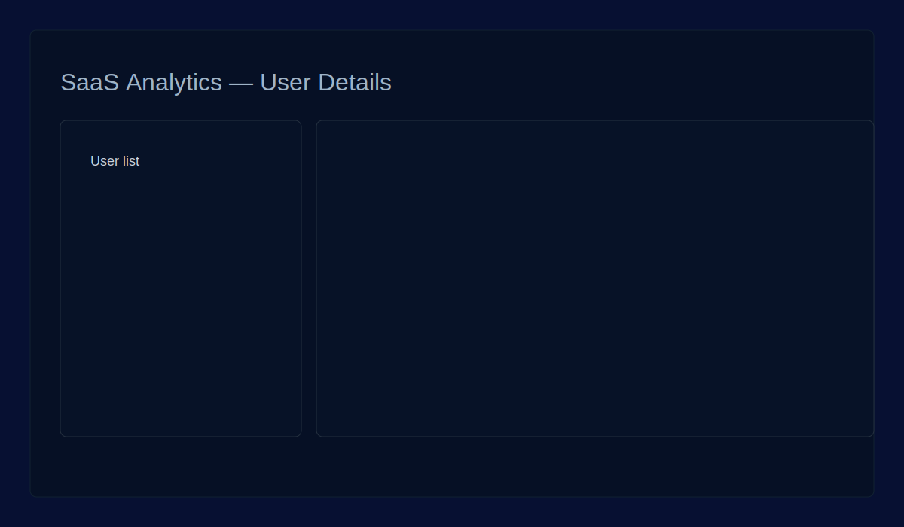

# SaaS Analytics Dashboard

Portfólio: painel analítico construído com Next.js (App Router), TypeScript e Tailwind.

Badges:

- Vercel: [](https://vercel.com)
- CI: 

Recursos:

- Next.js (App Router + Server Components)
- Autenticação com NextAuth (exemplo GitHub)
- Gráficos com Chart.js (`react-chartjs-2`)
- Layout responsivo com Tailwind CSS

Estrutura principal:

```
saas-analytics-dashboard/
├─ app/
│  ├─ layout.tsx
│  ├─ page.tsx
│  ├─ dashboard/page.tsx
├─ components/Sidebar.tsx
├─ components/StatsCard.tsx
├─ lib/auth.ts
├─ public/screenshots/
└─ README.md
```

Como rodar (local):

1. Instale dependências:

```bash
npm install
```

2. Rode em desenvolvimento:

```bash
npm run dev
```

3. Abra no navegador: `http://localhost:3000`

Configuração de autenticação:

- Copie `.env.local.example` para `.env.local` e preencha as variáveis `GITHUB_ID`, `GITHUB_SECRET` e `NEXTAUTH_SECRET`.
- Gere um `NEXTAUTH_SECRET` seguro (PowerShell):

```powershell
node -e "console.log(require('crypto').randomBytes(48).toString('hex'))"
```

Deploy (Vercel):

1. Crie um projeto no Vercel apontando para este repositório.
2. Adicione as Environment Variables (`GITHUB_ID`, `GITHUB_SECRET`, `NEXTAUTH_SECRET`, `NEXTAUTH_URL`).
3. Push para `main` dispara deploy automático.

Screenshots:





Licença:

Este projeto está licenciado sob a licença MIT — veja o arquivo `LICENSE`.

Arquivos importantes:

- `lib/auth.ts` — configuração do NextAuth
- `app/api/auth/[...nextauth]/route.ts` — rota de autenticação
- `components/StatsCard.tsx` — componente com Chart.js

Contribuições e melhorias planejadas:

- Ajustar conteúdos reais nos screenshots e adicionar testes end-to-end.
- Integrar deploy automático via Vercel / GitHub Actions (CI já roda build e lint).

Se quiser, eu adiciono instruções passo-a-passo para criar o OAuth App no GitHub e conectar os segredos ao Vercel.

Passo-a-passo: criar OAuth App no GitHub

1. Acesse https://github.com/settings/developers → `OAuth Apps` → `New OAuth App`.
2. Preencha:
	- **Application name:** SaaS Analytics Dashboard (ou seu nome)
	- **Homepage URL:** `http://localhost:3000` (para desenvolvimento) e adicione também o domínio de produção (ex.: `https://seu-projeto.vercel.app`).
	- **Authorization callback URL:** `http://localhost:3000/api/auth/callback/github` (em produção use `https://<SEU_DOMINIO>/api/auth/callback/github`).
3. Crie o App e copie o `Client ID` e o `Client Secret`.
4. Em local, coloque `GITHUB_ID` e `GITHUB_SECRET` no `.env.local`.
5. Em produção (Vercel): vá no projeto → Settings → Environment Variables e adicione `GITHUB_ID` e `GITHUB_SECRET` para as variáveis de ambiente (Production).

Informação adicional — `NEXTAUTH_URL` e `NEXTAUTH_SECRET`:

- `NEXTAUTH_URL` deve apontar para o domínio onde a aplicação rodará (ex.: `https://seu-projeto.vercel.app`).
- `NEXTAUTH_SECRET` é uma string longa aleatória usada para assinar tokens; gere localmente e cole nas variáveis de ambiente da Vercel.
